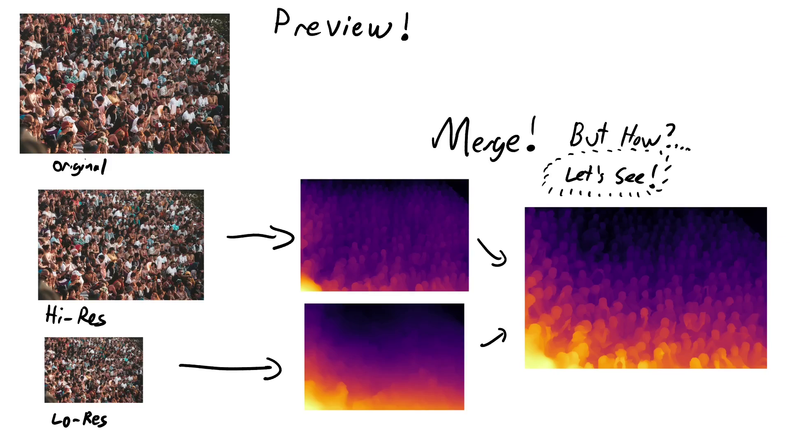
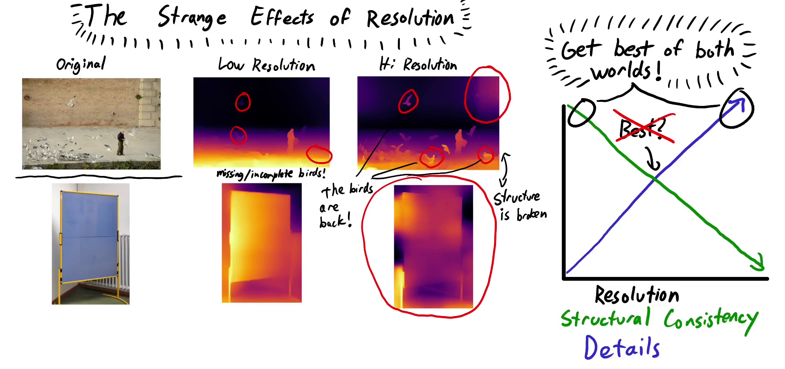
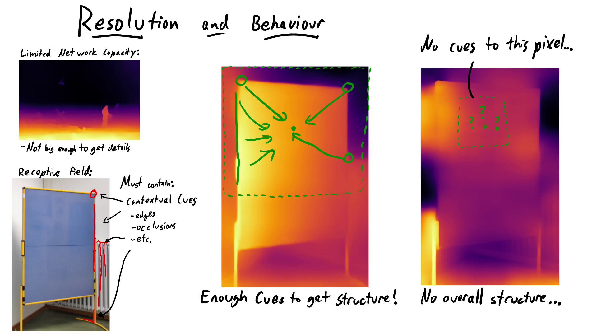
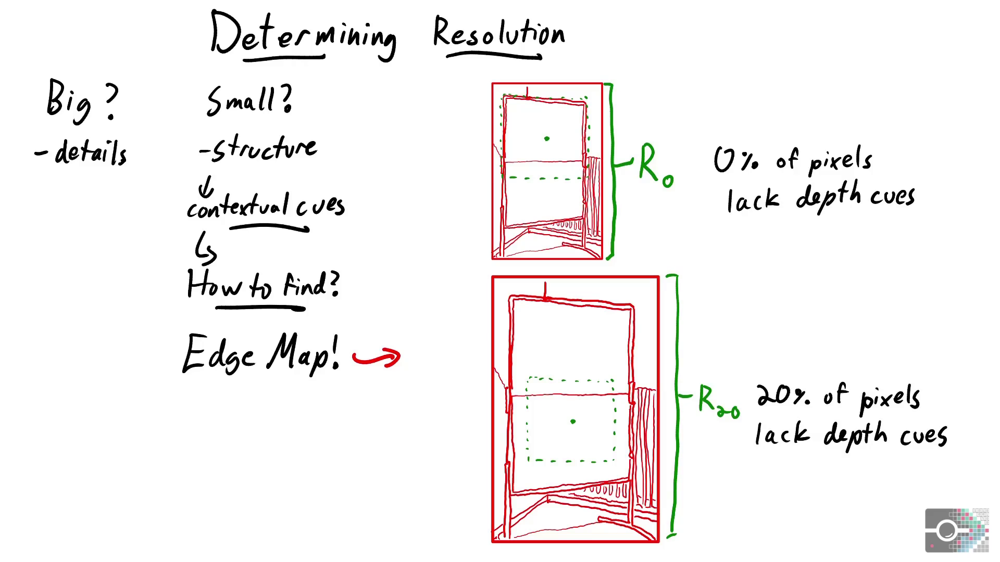
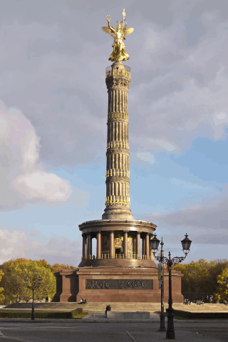
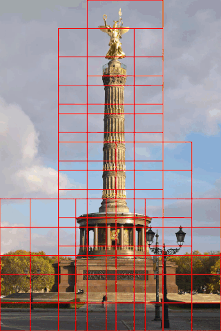
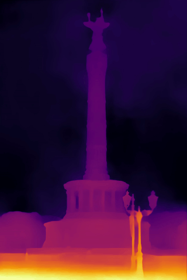

## Boosting Monocular Depth Estimation Models to High-Resolution via Content-Adaptive Multi-Resolution Merging 
> **Abstract**
> Neural networks have shown great abilities in estimating depth from a single image. However, the inferred depth maps are well below one-megapixel resolution and often lack fine-grained details, which limits their practicality. Our method builds on our analysis on how the input resolution and the scene structure affects depth estimation performance. We demonstrate that there is a trade-off between a consistent scene structure and the high-frequency details, and merge low- and high-resolution estimations to take advantage of this duality using a simple depth merging network. We present a double estimation method that improves the whole-image depth estimation and a patch selection method that adds local details to the final result. We demonstrate that by merging estimations at different resolutions with changing context, we can generate multi-megapixel depth maps with a high level of detail using a pre-trained model.
>
> S. Mahdi H. Miangoleh\*, Sebastian Dille\*, Long Mai, Sylvain Paris, Yağız Aksoy.
> [Main pdf](http://yaksoy.github.io/papers/CVPR21-HighResDepth.pdf),
> [Supplementary pdf](http://yaksoy.github.io/papers/CVPR21-HighResDepth-Supp.pdf),
> [Project Page](http://yaksoy.github.io/highresdepth/).


We propose a method that can generate highly detailed high-resolution depth estimations from a single image. Our method is based on optimizing the performance of a pre-trained network by merging estimations in different resolutions and different patches to generate a high-resolution estimate. 

Try our model easily on Colab : [](https://colab.research.google.com/github/compphoto/BoostingMonocularDepth/blob/main/Boostmonoculardepth.ipynb)


### Change log:

* A Quick overview of the method is now presented in README.md. [June 2021]
* [Google Colaboratory notebook](./Boostmonoculardepth.ipynb) is now available.  [June 2021]   [](https://colab.research.google.com/github/compphoto/BoostingMonocularDepth/blob/main/Boostmonoculardepth.ipynb)
* Merge net training dataset generation [instructions](./dataset_prepare/mergenet_dataset_prepare.md) is now available. [June 2021] 
* Bug fix. [June 2021]


## Method

We use **existing** *monocular depth estimation* networks to generate highly detailed estimations **without re-training**.

We achieve our results by getting several estimations at different resolutions. We then merge these into a structurally consistent high-resolution depth map followed by a local boosting to enhance the results and generate our final result.




##### Observations

Monocular depth estimation uses contextual cues such as occlusions or the relative sizes of objects to estimate the structure of the scene.

We will use a pre-trained [MiDas-v2][1] here, but our analysis with the [SGR][2] network also supports our claims.

When we feed the image to the network at different resolutions, some interesting patterns arise.
At lower resolutions, many details in the scene are missing, such as birds in this example. At high resolutions, however, we start to see inconsistent overall structure, and this flat board gets significantly less flat. The advantage is that the network is able to generate high frequency details.
This shows that there is a trade-off between structural consistency and high-frequency details with respect to input resolution.




##### Explanations

We explain this behavior through two properties of convolutional neural networks: limited **receptive field** size and **network capacity**.
The lack of high frequency details in low resolutions are due to a limited network capacity. A small network that generates the structure of a complex scene cannot also generate fine details.

The loss of structure at high resolutions comes from a limited receptive field size. The receptive field is the region around a pixel that contributes to the estimation at that pixel. It is set by the network configuration and training resolution, and effectively gets smaller as resolution increases. At a low resolution, every pixel can see the edges of the board, so the network judges that this is a flat wall. At a high resolution, however, some pixels do not receive any contextual information. This results in large structural inconsistencies.



##### Best resolution search 

For any given image, we determine the highest resolution that will result in a consistent structure by making sure that every pixel has contextual information. For this purpose, we need the distribution of contextual cues in the image. We approximate contextual cues with a simple edge map. 

The resolution where every pixel is at most a half receptive field size away from context edges is called R_0.
When we increase the resolution any further, structural inconsistencies will arise but more details will be generated. When 20% of the pixels do not receive any context, we call this resolution R_20.
**Note that R_0 and R_20 depend on the image content!**



##### Double Estimation

We are still able to go beyond R0 by merging the high-frequency details in the R20 resolution onto the structure of the base resolution. We call this **Double Estimation**.
We train an image-to-image translation network to merge the low-resolution depth range of the base with the high-resolution details of R_20. It does so without inheriting the structural inconsistencies of the high-res input. This way, we go beyond R_0 and generate more details by using R_20 as our high-resolution input. In fact, the network is so robust against low-frequency artifacts that we can even use R_20 as our high-resolution input.


##### Local Boosting

Note that R20 is *bounded by the smoothest regions* in the image, while there are image patches that could support a higher resolution.
We choose candidate patches by tiling the image and discarding all patches without useful details (step1). The leftover patches are expanded until their edge density matches that of the image(step2). Finally, we merge a double estimation for each patch onto our R20 results and generate our final results (step3).


Step 1: Tile and discard




Step 2: Expand

 


Step 3: Merge

 

## Setup

We Provided the implementation of our method using [MiDas-v2][1], [LeReS][2] and [SGRnet][3] as the base.

### Environments
Our mergenet model is trained using torch 0.4.1 and python 3.6 and is tested with torch<=1.8.

Download our mergenet model weights from [here](https://sfu.ca/~yagiz/CVPR21/latest_net_G.pth) and put it in 
> .\pix2pix\checkpoints\mergemodel\latest_net_G.pth

To use [MiDas-v2][1] or [LeReS][2] as base:
Install dependancies as following:
```sh
conda install pytorch torchvision opencv cudatoolkit=10.2 -c pytorch
conda install matplotlib
conda install scipy
conda install scikit-image
```
For MiDaS-v2, download the model weights from [MiDas-v2][1] and put it in 
> ./midas/model.pt

```sh
activate the environment
python run.py --Final --data_dir PATH_TO_INPUT --output_dir PATH_TO_RESULT --depthNet 0
```

For LeReS, download the model weights from [LeReS][2] and put it in root:
> ./res101.pth

```sh
activate the environment
python run.py --Final --data_dir PATH_TO_INPUT --output_dir PATH_TO_RESULT --depthNet 2
```

To use [SGRnet][3] as base:
Install dependancies as following:
```sh
conda install pytorch=0.4.1 cuda92 -c pytorch
conda install torchvision
conda install matplotlib
conda install scikit-image
pip install opencv-python
```
Follow the official [SGRnet][3] repository to compile the syncbn module in ./structuredrl/models/syncbn.
Download the model weights from [SGRnet][3] and put it in 
> ./structuredrl/model.pth.tar

```sh
activate the environment
python run.py --Final --data_dir PATH_TO_INPUT --output_dir PATH_TO_RESULT --depthNet 1
```

Different input arguments can be used to generate R0 and R20 results as discussed in the paper. 

```python
python run.py --R0 --data_dir PATH_TO_INPUT --output_dir PATH_TO_RESULT --depthNet #[0,1 or 2]
python run.py --R20 --data_dir PATH_TO_INPUT --output_dir PATH_TO_RESULT --depthNet #[0,1 or 2]
```

To generate the results with *CV.INFERNO* colormap use **--colorize_results** like the sample below:

```python
python run.py --colorize_results --Final --data_dir PATH_TO_INPUT --output_dir PATH_TO_RESULT --depthNet #[0or1]
```

### Evaluation
Fill in the needed variables in the following matlab file and run:
>./evaluation/evaluatedataset.m

* **estimation_path** : path to estimated disparity maps
* **gt_depth_path** : path to gt depth/disparity maps
* **dataset_disp_gttype** : (true) if ground truth data is disparity and (false) if gt depth data is depth.
* **evaluation_matfile_save_dir** : directory to save the evalution results as .mat file. 
* **superpixel_scale** : scale parameter to run the superpixels on scaled version of the ground truth images to accelarate the evaluation. use 1 for small gt images.


### Training

Navigate to [dataset preparation instructions](./dataset_prepare/mergenet_dataset_prepare.md) to download and prepare the training dataset. 

```sh
python ./pix2pix/train.py --dataroot DATASETDIR --name mergemodeltrain --model pix2pix4depth --no_flip --no_dropout
```
```sh
python ./pix2pix/test.py --dataroot DATASETDIR --name mergemodeleval --model pix2pix4depth --no_flip --no_dropout
```


## Citation

This implementation is provided for academic use only. Please cite our paper if you use this code or any of the models.
```
@INPROCEEDINGS{Miangoleh2021Boosting,
author={S. Mahdi H. Miangoleh and Sebastian Dille and Long Mai and Sylvain Paris and Ya\u{g}{\i}z Aksoy},
title={Boosting Monocular Depth Estimation Models to High-Resolution via Content-Adaptive Multi-Resolution Merging},
journal={Proc. CVPR},
year={2021},
}
```

## Credits

The "Merge model" code skeleton (./pix2pix folder) was adapted from the [pytorch-CycleGAN-and-pix2pix][4] repository. 

For MiDaS, LeReS and SGR inferences we used the scripts and models from [MiDas-v2][1], [LeReS][2] and [SGRnet][3] respectively (./midas, ./lib and ./structuredrl folders). 

Thanks to [k-washi](https://github.com/k-washi) for providing us with a Google Colaboratory notebook implementation.

[1]: https://github.com/intel-isl/MiDaS/tree/v2
[2]: https://github.com/aim-uofa/AdelaiDepth/tree/main/LeReS
[3]: https://github.com/KexianHust/Structure-Guided-Ranking-Loss
[4]: https://github.com/junyanz/pytorch-CycleGAN-and-pix2pix

